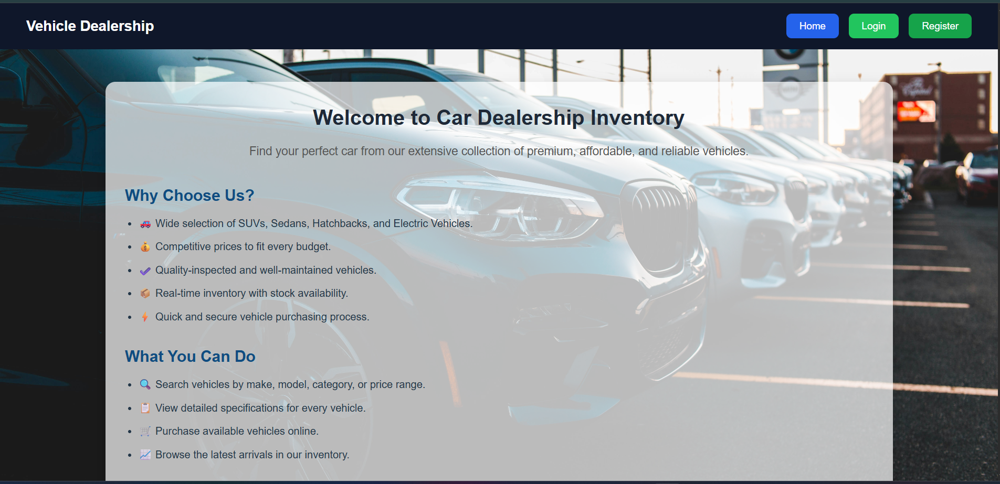
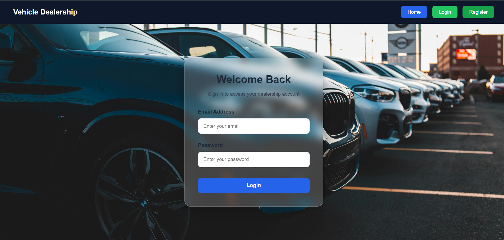
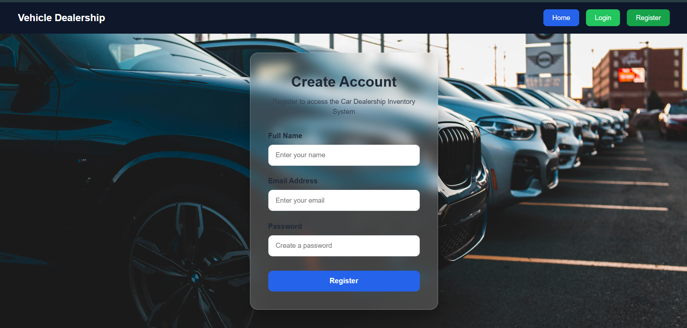
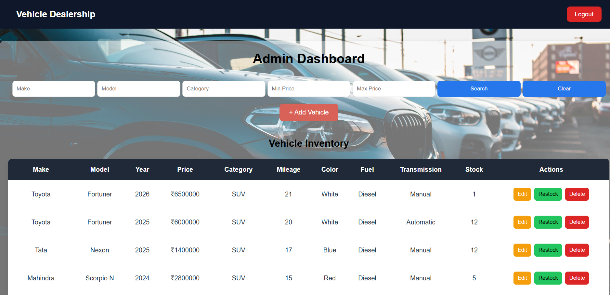
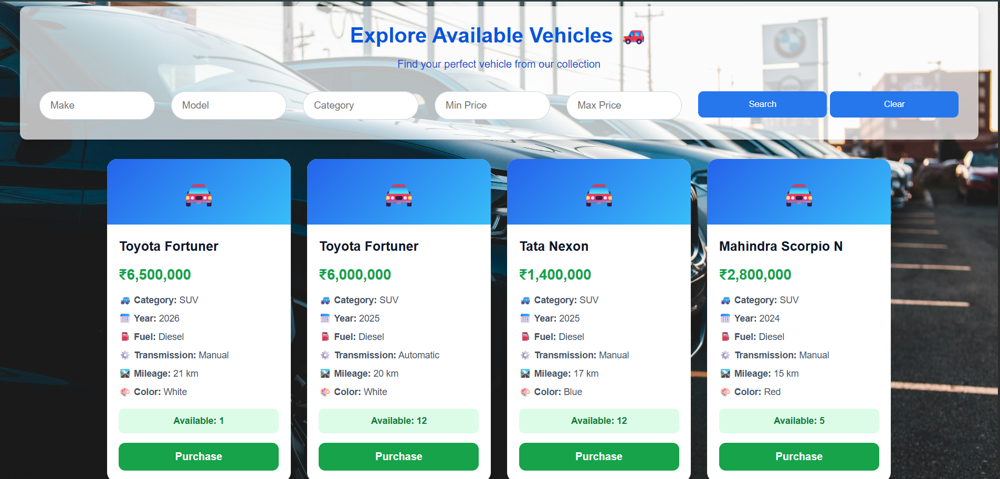
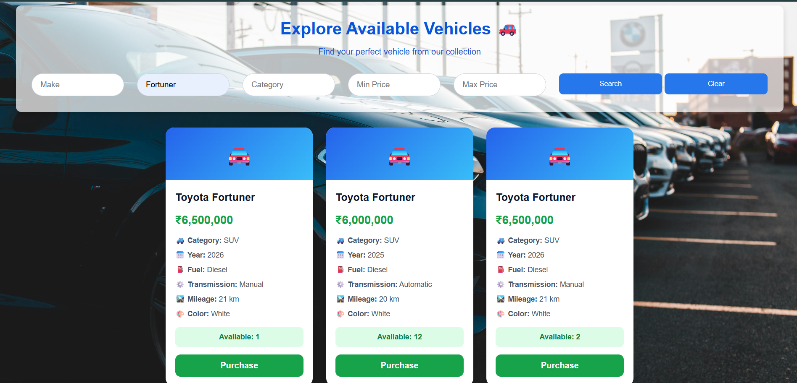
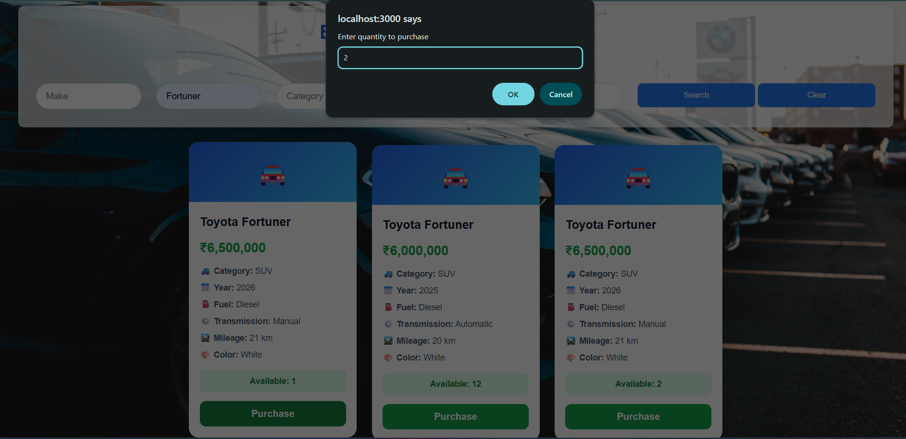
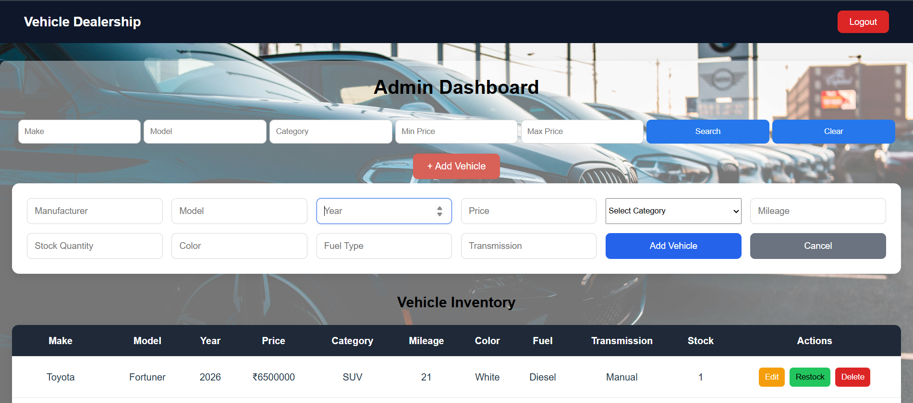
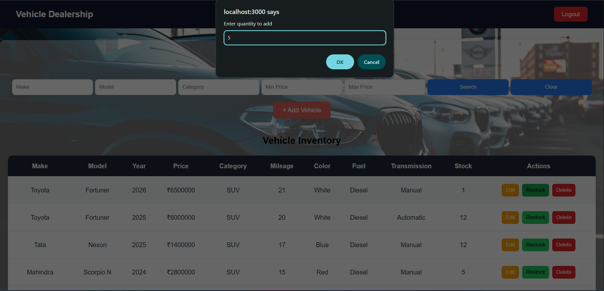

# Car Dealership Inventory System

A full-stack car dealership inventory application built with **Test-Driven Development (TDD)**.

## Tech Stack

| Layer    | Technology                                        |
| -------- | ------------------------------------------------- |
| Backend  | Node.js, Express, JavaScript                      |
| Frontend | React, Vite                                       |
| Database | MongoDB (Docker for dev, Memory Server for tests) |
| Auth     | JWT (jsonwebtoken + bcryptjs)                     |

## Project Structure

```
car_dealership_system/
├── backend/          # REST API
├── frontend/         # React SPA
├── docker-compose.yml
└── README.md
```

## Getting Started

### Prerequisites

- Node.js (v18+)
- Docker (for MongoDB)

### Installation

```bash
npm run install:all
cp backend/.env.example backend/.env
npm run db:up
```

### Running the App

```bash
npm run dev:backend    # http://localhost:5000
npm run dev:frontend   # http://localhost:3000
```

### Running Tests

```bash
npm test                          # all tests
npm run test:watch --prefix backend   # TDD watch mode (backend)
npm run test:watch --prefix frontend  # TDD watch mode (frontend)
```

---

## TDD Development Log

We follow the **Red → Green → Refactor** cycle. Each feature is built in three steps:

1. **Red** — Write failing tests that define expected behavior
2. **Green** — Implement the minimum code to make tests pass
3. **Refactor** — Clean up while keeping tests green

### Step 1: Project Setup ✅

- Monorepo structure with backend and frontend
- Express API with health check endpoint
- React + Vite frontend scaffold
- Jest + Supertest + MongoDB Memory Server for backend TDD
- Vitest + React Testing Library for frontend TDD
- Docker Compose for local MongoDB

**Tests:** `GET /api/health` — passing

---

### Step 2: User Registration — ✅ REFACTOR (complete)

**Endpoint:** `POST /api/auth/register`

**Test file:** `backend/tests/auth/register.test.js`

| Test Case                      | Expected Status | Description                                    |
| ------------------------------ | --------------- | ---------------------------------------------- |
| Register with valid details    | 201             | Returns user object (id, name, email, role)    |
| Password is hashed in database | —               | Stored password is bcrypt hash, not plain text |
| Missing name                   | 400             | Validation error for name                      |
| Missing email                  | 400             | Validation error for email                     |
| Missing password               | 400             | Validation error for password                  |
| Invalid email format           | 400             | Validation error for email                     |
| Password too short (< 6 chars) | 400             | Validation error for password                  |
| Duplicate email                | 409             | Conflict error when email already exists       |

**Architecture (after refactor):**

| Layer      | File                              | Responsibility                 |
| ---------- | --------------------------------- | ------------------------------ |
| Route      | `routes/authRoutes.js`            | HTTP routing + async wrapper   |
| Controller | `controllers/authController.js`   | Request/response orchestration |
| Service    | `services/authService.js`         | User lookup and creation       |
| Validator  | `validators/registerValidator.js` | Input validation rules         |
| Model      | `models/User.js`                  | Schema + password hashing      |
| Middleware | `middleware/asyncHandler.js`      | Async error propagation        |
| Middleware | `middleware/errorHandler.js`      | Centralized error responses    |
| Utils      | `utils/formatUser.js`             | Public user response shape     |
| Utils      | `utils/constants.js`              | Shared validation constants    |

**Refactor improvements:**

- Separated validation logic from controller (Single Responsibility)
- Extracted database operations into auth service layer
- Reusable `formatUserResponse` for consistent API output
- Centralized error handling via middleware
- Shared constants for email regex and password rules

**Status:** All 8 registration tests passing after refactor.

---

### Step 3: User Login — ✅ REFACTOR (complete)

**Endpoint:** `POST /api/auth/login`

**Test file:** `backend/tests/auth/login.test.js`

| Test Case                      | Expected Status | Description                        |
| ------------------------------ | --------------- | ---------------------------------- |
| Login with valid credentials   | 200             | Returns JWT token and user object  |
| JWT contains user id and email | —               | Token decodes with correct payload |
| Missing email                  | 400             | Validation error for email         |
| Missing password               | 400             | Validation error for password      |
| Invalid email format           | 400             | Validation error for email         |
| User does not exist            | 401             | Invalid credentials error          |
| Incorrect password             | 401             | Invalid credentials error          |

**Request body:**

```json
{
  "email": "john@example.com",
  "password": "password123"
}
```

**Expected success response (200):**

```json
{
  "message": "Login successful",
  "token": "<jwt-token>",
  "user": {
    "id": "<mongodb-id>",
    "name": "John Doe",
    "email": "john@example.com",
    "role": "user"
  }
}
```

**Status:** All 5 login tests passing.

---

### Step 4: Admin Seeding — ✅ REFACTOR (complete)

**Functionality:** Auto-seed admin user on server startup

**Test file:** `backend/tests/seeds/seedAdmin.test.js`

| Test Case                               | Description                                      |
| --------------------------------------- | ------------------------------------------------ |
| Admin created with correct email & role | Admin account initialized at startup             |
| Password stored as bcrypt hash          | Password security verified                       |
| No duplicate admin on re-seed           | Idempotent seeding (safe to call multiple times) |
| Admin can login with credentials        | Admin user (parimal3010@gmail.com / 123456)      |
| Admin login fails with wrong password   | Invalid credentials rejected                     |

**Implementation:**

| Component          | File                            | Responsibility                         |
| ------------------ | ------------------------------- | -------------------------------------- |
| Seed Function      | `seeds/seedAdmin.js`            | Initialize admin user in database      |
| Server Integration | `server.js`                     | Call seedAdmin() after DB connection   |
| Test Suite         | `tests/seeds/seedAdmin.test.js` | Verify seeding and login functionality |

**Admin Credentials (hardcoded):**

- Email: `parimal3010@gmail.com`
- Password: `123456` (hashed with bcrypt)
- Role: `admin`

**Features:**

- ✅ Prevents duplicate admin creation
- ✅ Runs automatically on server startup
- ✅ Uses bcrypt hashing for password security
- ✅ Admin can login and receive JWT token

**Status:** All 5 seed tests passing. Admin auto-seeded on every server start.

---

### Step 5: Add Vehicle (Admin Only) — ✅ REFACTOR (complete)

**Endpoint:** `POST /api/vehicles`

**Test file:** `backend/tests/vehicles/addVehicle.test.js`

**Authorization:** Admin-only (requires valid JWT with admin role)

| Test Category           | Test Cases | Expected Status | Description                                                                          |
| ----------------------- | ---------- | --------------- | ------------------------------------------------------------------------------------ |
| **Successful Creation** | 2          | 201             | Admin creates vehicle & persists to DB                                               |
| **Authorization**       | 3          | 401/403         | No token, invalid token, non-admin user                                              |
| **Validation**          | 7          | 400             | Missing fields (make, model, year, price), invalid year, negative price, future year |

**Request body:**

```json
{
  "make": "Toyota",
  "model": "Camry",
  "year": 2023,
  "price": 25000,
  "mileage": 5000,
  "color": "Silver",
  "fuelType": "Gasoline",
  "transmission": "Automatic"
}
```

**Expected success response (201):**

```json
{
  "message": "Vehicle added successfully",
  "vehicle": {
    "id": "<mongodb-id>",
    "make": "Toyota",
    "model": "Camry",
    "year": 2023,
    "price": 25000,
    "mileage": 5000,
    "color": "Silver",
    "fuelType": "Gasoline",
    "transmission": "Automatic",
    "createdAt": "<timestamp>"
  }
}
```

**Validation Rules:**

- `make` (required, string)
- `model` (required, string)
- `year` (required, number, ≤ current year)
- `price` (required, number, ≥ 0)
- `mileage` (optional, number, ≥ 0)
- `color` (optional, string)
- `fuelType` (optional, string)
- `transmission` (optional, string)

**Test Summary:**

- ✅ 12 test cases written & passing
- ✅ All validation and authorization tests passing
- ✅ Refactored for clean code (grouped validations, clear comments)
- ✅ Inline validation pattern (matches login controller style)

**Implementation Details:**

| Component  | File                               | Pattern                                 |
| ---------- | ---------------------------------- | --------------------------------------- |
| Controller | `controllers/vehicleController.js` | Inline validation, direct DB operations |
| Middleware | `middleware/authMiddleware.js`     | JWT + role-based authorization          |
| Routes     | `routes/vehicleRoutes.js`          | Protected with auth & admin checks      |
| Format     | `utils/formatVehicle.js`           | Response formatting utility             |
| Model      | `models/Vehicle.js`                | MongoDB schema with validations         |

**Refactor Improvements:**

- Grouped validation by type (required fields, year checks, price checks)
- Organized comments for readability
- Direct `Vehicle.create()` in controller (no service layer)
- Consistent response formatting
- Admin-only access via middleware

---

### Step 6: View Vehicles (List All) — ✅ REFACTOR (complete)

**Endpoint:** `GET /api/vehicles`

**Test file:** `backend/tests/vehicles/getVehicles.test.js`

**Authorization:** Protected (requires valid JWT, all authenticated users can access)

| Test Category            | Test Cases | Expected Status | Description                                                                       |
| ------------------------ | ---------- | --------------- | --------------------------------------------------------------------------------- |
| **Successful Retrieval** | 5          | 200             | Empty list, all vehicles, correct structure, no sensitive data, sorted descending |
| **Pagination**           | 3          | 200             | Limit/skip parameters, vehicle count, total count                                 |
| **Authorization**        | 3          | 401             | No token, invalid token, both admin/user can access                               |
| **Error Handling**       | 2          | 200             | Invalid limit, invalid skip (graceful handling)                                   |

**Request (with optional query parameters):**

```
GET /api/vehicles?limit=10&skip=0
Authorization: Bearer <jwt-token>
```

**Expected success response (200):**

```json
{
  "message": "Vehicles retrieved successfully",
  "vehicles": [
    {
      "id": "<mongodb-id>",
      "make": "Toyota",
      "model": "Camry",
      "year": 2023,
      "price": 25000,
      "mileage": 5000,
      "color": "Silver",
      "fuelType": "Gasoline",
      "transmission": "Automatic",
      "createdAt": "<timestamp>"
    }
  ],
  "count": 1,
  "totalCount": 5
}
```

**Query Parameters:**

- `limit` (optional, number, default: 10) — Max vehicles to return
- `skip` (optional, number, default: 0) — Number of vehicles to skip

**Test Summary:**

- ✅ 13 test cases written & passing
- ✅ Successful retrieval tests (5/5 passing)
- ✅ Pagination tests (3/3 passing)
- ✅ Authorization tests (3/3 passing)
- ✅ Error handling tests (2/2 passing)

**Implementation Details (after refactor):**

| Layer      | File                               | Responsibility                        |
| ---------- | ---------------------------------- | ------------------------------------- |
| Controller | `controllers/vehicleController.js` | Request/response orchestration        |
| Service    | `services/vehicleService.js`       | Database operations (getAllVehicles)  |
| Validator  | `validators/vehicleValidator.js`   | Pagination parameter validation       |
| Route      | `routes/vehicleRoutes.js`          | HTTP routing + auth middleware        |
| Middleware | `middleware/authMiddleware.js`     | JWT authentication (no role required) |
| Format     | `utils/formatVehicle.js`           | Response formatting utility           |
| Model      | `models/Vehicle.js`                | MongoDB schema                        |

**Refactor Improvements:**

- Separated pagination validation into `validatePaginationParams()` function
- Extracted database operations into `getAllVehicles()` service function
- Clean controller that orchestrates validator → service → response
- Consistent with auth refactor pattern (validator + service layers)
- Safe parameter handling with Math.max() for graceful invalid input handling

**Features:**

- ✅ Retrieve all vehicles with pagination
- ✅ Sort by creation date (newest first)
- ✅ Support limit and skip query parameters
- ✅ Return total vehicle count and current page count
- ✅ Accessible to all authenticated users (admin + regular users)
- ✅ Return cleanly formatted vehicles (no database metadata)

---

### Step 7: Search Vehicles (Query Filters) — 🔴 RED (tests written)

**Endpoint:** `GET /api/vehicles/search`

**Test file:** `backend/tests/vehicles/searchVehicles.test.js`

**Authorization:** Protected (requires valid JWT, all authenticated users)

**Search by:**

- `make` (e.g., "Toyota") — case-insensitive
- `model` (e.g., "Camry") — case-insensitive
- `fuelType` (e.g., "Gasoline", "Electric", "Hybrid") — case-insensitive
- `year` (e.g., 2023) — exact match
- `minPrice` & `maxPrice` (e.g., 20000-30000) — price range
- **All parameters are optional and combinable**

**Request (with optional query parameters):**

```
GET /api/vehicles/search?make=Toyota&fuelType=Gasoline&minPrice=20000&maxPrice=30000&limit=10&skip=0
Authorization: Bearer <jwt-token>
```

**Expected success response (200):**

```json
{
  "message": "Vehicles retrieved successfully",
  "vehicles": [
    {
      "id": "<mongodb-id>",
      "make": "Toyota",
      "model": "Camry",
      "year": 2023,
      "price": 25000,
      "mileage": 5000,
      "color": "Silver",
      "fuelType": "Gasoline",
      "transmission": "Automatic",
      "createdAt": "<timestamp>"
    }
  ],
  "count": 1,
  "totalCount": 5
}
```

**Query Parameters:**

- `make` (optional, string) — Search by vehicle make
- `model` (optional, string) — Search by vehicle model
- `fuelType` (optional, string) — Search by fuel type
- `year` (optional, number) — Filter by exact year
- `minPrice` (optional, number) — Minimum price (default: 0)
- `maxPrice` (optional, number) — Maximum price (no limit if not provided)
- `limit` (optional, number, default: 10) — Max results per page
- `skip` (optional, number, default: 0) — Results to skip for pagination

**Test Summary:**

- ✅ 28 test cases written (all currently failing — RED phase)
- ✅ Search by individual filters (6 tests)
- ✅ Search by combined filters (4 tests)
- ✅ Price range filtering (5 tests)
- ✅ Year filtering (2 tests)
- ✅ Pagination with search (2 tests)
- ✅ Authorization (3 tests)
- ✅ Response format validation (2 tests)
- ✅ Empty results handling (1 test)
- ✅ Sorting validation (1 test)

**Test Categories:**

| Category         | Test Count | Description                                        |
| ---------------- | ---------- | -------------------------------------------------- |
| Search by make   | 2          | Case-insensitive, no results                       |
| Search by model  | 2          | Case-insensitive, no results                       |
| Search by fuel   | 2          | Gasoline, Electric, etc.                           |
| Price range      | 5          | Min/Max/Both, negative handling, no results        |
| Year filter      | 2          | Exact match, no results                            |
| Combined filters | 4          | Make+Fuel, Price+Fuel, Year+Make+Price, no matches |
| Pagination       | 2          | Limit/skip with search results                     |
| Authorization    | 3          | No token, invalid token, admin+user access         |
| Response format  | 2          | Field validation, no sensitive data                |
| Empty results    | 1          | No matches message and formatting                  |
| Sorting          | 1          | Newest first by createdAt                          |

**Status:** ⏳ Awaiting implementation (GREEN phase). All tests currently failing (404 endpoint not found).

---

## API Endpoints Summary

| Method | Endpoint                     | Auth      | Status           | Phase |
| ------ | ---------------------------- | --------- | ---------------- | ----- |
| GET    | `/api/health`                | Public    | ✅ Done          | ✅    |
| POST   | `/api/auth/register`         | Public    | ✅ Done          | ✅    |
| POST   | `/api/auth/login`            | Public    | ✅ Done          | ✅    |
| POST   | `/api/vehicles`              | Admin     | ✅ Done          | ✅    |
| GET    | `/api/vehicles`              | Protected | ✅ Done          | ✅    |
| GET    | `/api/vehicles/search`       | Protected | 🔴 Tests Written | RED   |
| PUT    | `/api/vehicles/:id`          | Admin     | ⬜ Pending       | —     |
| DELETE | `/api/vehicles/:id`          | Admin     | ⬜ Pending       | —     |
| POST   | `/api/vehicles/:id/purchase` | Protected | ⬜ Pending       | —     |
| POST   | `/api/vehicles/:id/restock`  | Admin     | ⬜ Pending       | —     |

---

## Git Commit Convention

When using AI assistance, add a co-author trailer:

```
feat: add registration tests (TDD red phase)

Co-authored-by: Cursor AI <AI@users.noreply.github.com>
```

## How I Used AI

Throughout the development of this project, I used ChatGPT as a programming assistant to improve productivity and assist with implementation.

### Backend Development

I used ChatGPT to:

- Generate Express controller and service layer boilerplate.
- Implement vehicle CRUD operations.
- Design search functionality using MongoDB query filters.
- Implement purchase and restock APIs.
- Assist in adding the vehicle category field across the application.
- Debug backend errors and improve validation logic.

### Frontend Development

I used ChatGPT to:

- Design and improve the Admin Dashboard.
- Build the User Dashboard with responsive vehicle cards.
- Implement vehicle search functionality.
- Integrate purchase and restock features.
- Improve Login, Register, and Home page UI.
- Create responsive layouts using CSS.
- Improve navigation based on user roles.
- Help troubleshoot React routing and component issues.

### General Development

I also used ChatGPT to:

- Explain programming concepts.
- Generate sample vehicle data for testing.
- Create Git commit messages following project requirements.
- Review code structure and suggest improvements.
- Assist in writing this README documentation.

---

## Reflection

Using ChatGPT significantly improved my development workflow by reducing the time required to implement repetitive code, troubleshoot errors, and refine both backend and frontend components.

Rather than replacing my understanding of the project, ChatGPT served as a development assistant that helped me explore implementation ideas, resolve issues more efficiently, and improve the overall quality and consistency of the application.

I reviewed, modified, and tested all AI-generated code before integrating it into the final project to ensure it met the project requirements and functioned correctly.

---

## Future Improvements

- Vehicle image upload
- Advanced filtering and sorting
- Pagination for search results
- Wishlist functionality
- Order history
- User profile management
- Admin analytics dashboard
- Email notifications after purchase

## Screenshots

### Home Page



---

### Login Page



---

### Register Page



---

### Admin Dashboard



---

### User Dashboard



---

### Vehicle Search



---

### Purchase Vehicle



---

### Add Vehicle



---

### Restock Vehicle



